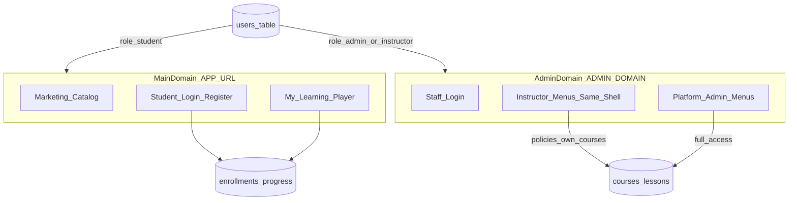
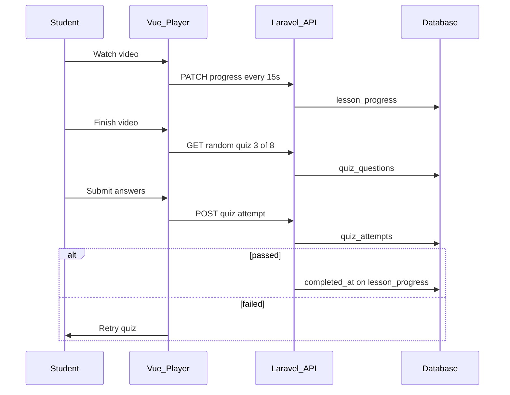

# Udemy-Style E-Learning — Phased Plan

> **Stack:** Laravel 13 · Inertia 3 · Vue 3 · Metronic 9  
> **Portals:** Student (`APP_URL`) · Admin + instructors (`ADMIN_DOMAIN`)  
> **Last updated:** 2026-05-28

## Implementation checklist

- [x] **Phase 0:** Remove `MEMBER_DOMAIN` scaffold; Spatie roles; dual-portal session auth; permission-based admin sidebar
- [x] **Phase 1:** Categories, courses, sections, lessons — admin/instructor CRUD with policies
- [x] **Phase 1b:** Course approval workflow — instructor submit → admin review summary → approve/reject
- [x] **Phase 1c:** Admin UX — CKEditor for articles/summaries; clearer lesson creation flow on course edit
- [x] **Phase 2:** Public catalog + course detail + free enrollment + my learning dashboard
- [ ] **Phase 3:** Video upload/streaming, lesson player, progress tracking, summaries, mini quizzes
- [ ] **Phase 4:** Reviews, moderation queue, user/role management, notifications
- [ ] **Phase 5:** Stripe/checkout, orders, instructor payouts (when ready)

---

## Current codebase (baseline)

The repo is a **Metronic-themed Inertia shell**, not yet a product:

| Area | Status |
|------|--------|
| Stack | Laravel 13, Inertia 3, Vue 3, Vite 8, Metronic assets in `public/assets/` |
| UI | Admin layout ported (`resources/js/Pages/Layouts/AdminDashboardLayout.vue`, large `Sidebar.vue`) |
| Auth | Login UIs only (`method="get"`, `action="#"`) — no session login |
| Data | Only `User` + default Laravel migrations |
| Routing | Main `routes/web.php` + `routes/admin.php` on `ADMIN_DOMAIN`; `routes/member.php` on `MEMBER_DOMAIN` is **legacy** and should be removed |

Reference HTML lives under `template/demo1/` (Metronic v9.4.x). Key mappings:

- **Student storefront / catalog** → `template/demo1/store-client/`
- **Auth** → `template/demo1/authentication/branded/` (partially ported in `Admin/Login.vue`)
- **RBAC admin UI** → `template/demo1/account/members/`
- **Instructor public profile (later)** → `template/demo1/public-profile/profiles/creator.html`

---

## Recommended roles

Four roles on one `users` table. Permissions differ by **portal**, not duplicate accounts.

| Role | Portal | Primary responsibilities |
|------|--------|---------------------------|
| **student** | Main domain (`APP_URL`) | Browse catalog, enroll, watch lessons, track progress, reviews (later) |
| **instructor** | Admin subdomain | Create/edit own courses, sections, lessons, uploads; view enrollments & analytics |
| **admin** | Admin subdomain | Manage users, categories, moderate/publish any course, platform settings |
| **super_admin** | Admin subdomain | Full access (optional; can start with just `admin`) |

**Not in MVP:** separate teacher subdomain, `MEMBER_DOMAIN`, enterprise org admin (Phase 6+).

**Authorization:** [spatie/laravel-permission](https://github.com/spatie/laravel-permission)



---

## Portal architecture

### Main domain — student portal

- Public marketing home, course catalog, course detail
- Student registration, login, password reset
- Authenticated: “My learning”, lesson player, progress

### Admin subdomain — staff portal (admin + instructor)

- Single Metronic admin shell; sidebar driven by permissions
- Instructors: Courses, Media, Students, Analytics
- Admins: everything (+ Users, Categories, Moderation, Settings)

### Cleanup from current scaffold

- Remove `routes/member.php`, `MemberController`, `Pages/Members/*`, `MEMBER_DOMAIN` in `bootstrap/app.php`
- Add `ADMIN_DOMAIN` to `.env.example`
- **Local dev vhosts:**

```env
APP_URL=http://elearning.local
ADMIN_DOMAIN=admin.elearning.local
```

Both vhosts point at `public/`. Separate sessions per domain for MVP (no shared `SESSION_DOMAIN` unless SSO needed later).

---

## Video upload, progress, summaries, and mini quizzes

All feasible on Laravel + Inertia + Vue without paid video SaaS in early phases.

### Video upload (instructor, admin panel)

- Upload MP4 via lesson editor → `storage/app/courses/{course_id}/` or `public` disk
- Validate size/mime; optional FFmpeg `ffprobe` for `duration_seconds`
- Serve via protected route or `Storage::url()`; HTML5 `<video>` (or Plyr/Video.js)
- Later: Mux / Bunny Stream for adaptive bitrate

### Progress tracking

- `lesson_progress`: `last_position_seconds`, `watched_percent`, `completed_at`
- Throttled `timeupdate` → `PATCH /learn/lessons/{lesson}/progress`
- Complete when: watched ≥ 90% **and** mini quiz passed (if required)
- Course % = completed lessons / total

### Lesson summary

- `lessons.summary` (text/HTML) below player or in Notes tab
- `courses.summary` for catalog/marketing

### Small random quiz (per lesson)

```
quiz_questions (lesson_id, prompt, sort_order)
quiz_options (question_id, label, is_correct)
quiz_attempts (user_id, lesson_id, score, passed, completed_at)
quiz_attempt_answers (attempt_id, question_id, option_id)
```

- Instructor adds 3–10 questions; API returns N random (e.g. 3 of 8)
- Pass threshold default 70%; retakes optional in Phase 4



---

## Core domain model

```
categories
courses (instructor_id, category_id, slug, title, summary, thumbnail, status, price nullable)
sections (course_id, sort_order)
lessons (
  section_id, title, type: video|article,
  summary, content,
  video_path, video_disk, duration_seconds,
  require_quiz_to_complete, quiz_pass_percent default 70,
  sort_order, is_preview
)
enrollments (user_id, course_id, enrolled_at)
lesson_progress (enrollment_id, lesson_id, last_position_seconds, watched_percent, completed_at)

quiz_questions (lesson_id, prompt, sort_order)
quiz_options (quiz_question_id, label, is_correct)
quiz_attempts (user_id, lesson_id, enrollment_id, score, passed, completed_at)
quiz_attempt_answers (quiz_attempt_id, quiz_question_id, quiz_option_id)
```

**Course lifecycle:** `draft` → `pending_review` (optional) → `published` → `archived`

---

## Phased implementation

### Phase 0 — Foundation and cleanup (1–2 weeks)

- Remove member-domain legacy
- Spatie permission; seed `student`, `instructor`, `admin`, (`super_admin`)
- Session auth for Inertia (Breeze Inertia/Vue or hand-rolled controllers + Metronic forms)
- Admin auth on `ADMIN_DOMAIN`; student auth on main domain
- Middleware: `EnsureStaff`, `EnsureStudent`, permission-based sidebar
- `.env.example`: `APP_URL`, `ADMIN_DOMAIN`

**Deliverable:** Working login on both portals; role-based admin menu.

### Phase 1 — Course management in admin (2–3 weeks)

- Models: Category, Course, Section, Lesson + quiz tables
- CRUD: categories (admin), courses (policy-scoped), lesson editor with video upload + quiz builder
- Course status workflow

**Deliverable:** Staff can build a multi-section course with videos and quizzes.

### Phase 2 — Student catalog and free enrollment (2–3 weeks)

- Catalog + course detail (store-client templates)
- Free enrollment; “My learning” dashboard with progress %

**Deliverable:** Browse, enroll, see enrolled courses.

### Phase 3 — Learning experience (2–3 weeks)

- Protected video streaming; lesson player + summary
- Progress API; random mini quiz; course completion

**Deliverable:** Watch → summary → quiz → progress saved.

### Phase 4 — Trust and admin ops (2 weeks)

- Reviews, moderation queue, user management, email notifications

### Phase 5 — Monetization (when ready)

- Stripe/Cashier, orders, instructor payouts

### Phase 6+ — Backlog

- Full timed exams, certificates, coupons, org/teams, live sessions, Mux/DRM, i18n/SEO

---

## Technical conventions

- **Pages:** `Pages/Admin/*` (staff), `Pages/Student/*` or `Pages/Public/*` (main)
- **Layouts:** `layout` export + `KTComponents.init()` / `KTLayout.init()` after navigation
- **Shared Inertia props:** `auth.user`, roles, permissions in `HandleInertiaRequests`

```php
// routes/web.php — main domain
Route::middleware('auth')->group(...);

// routes/admin.php — ADMIN_DOMAIN only
Route::middleware(['auth', 'staff'])->group(...);
```

---

## Suggested first sprint

1. Phase 0 cleanup + `ADMIN_DOMAIN` in env
2. Spatie roles + registration flows
3. Permission-based admin sidebar
4. Phase 1 migrations and course CRUD

---

## Decisions locked

| Decision | Choice |
|----------|--------|
| Payments | Later (free enrollment first) |
| Instructor UX | Admin panel with role permissions |
| Member subdomain | Remove; not used |
| Video | File upload + HTML5 player; Mux/CDN later |
| Progress | Periodic saves + % threshold |
| Mini quizzes | Per-lesson random subset; pass to complete (configurable) |
| Local admin vhost | `admin.elearning.local` |

**Open later:** student → instructor upgrade (admin-only vs self-serve application).
